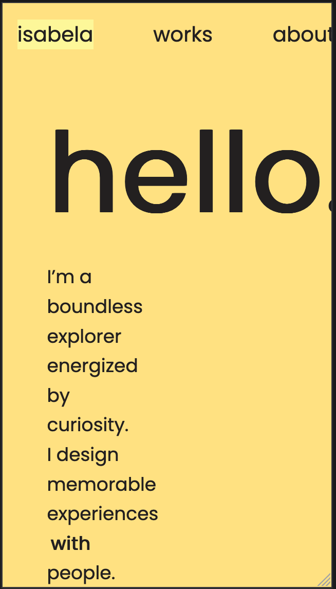
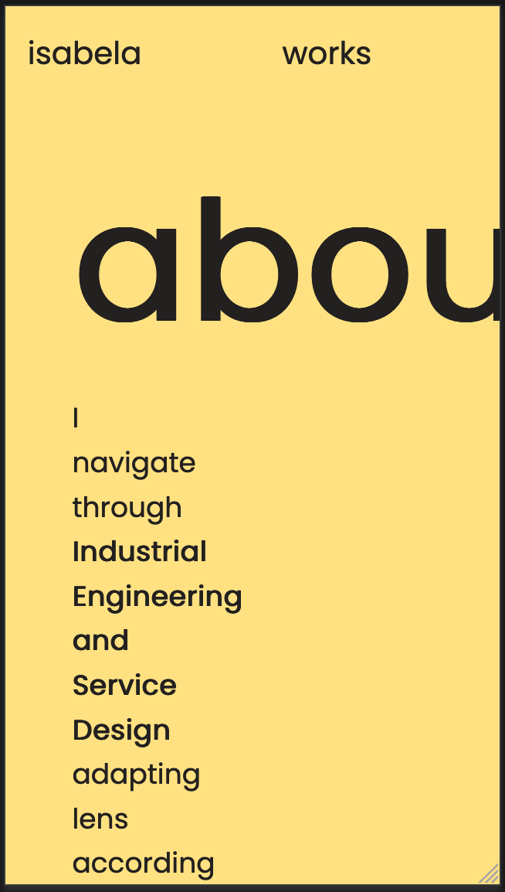
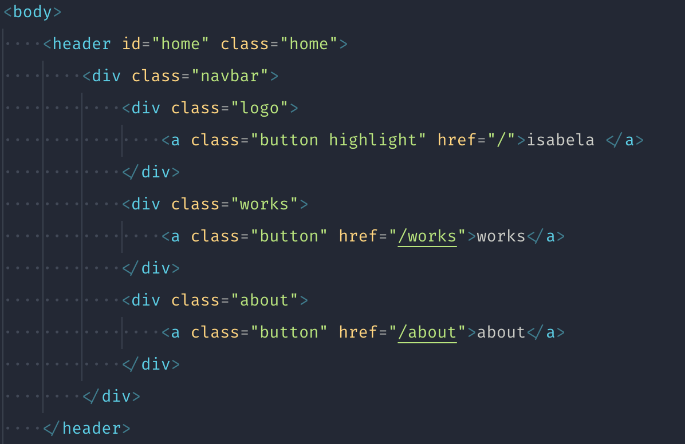
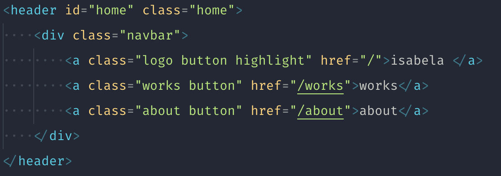
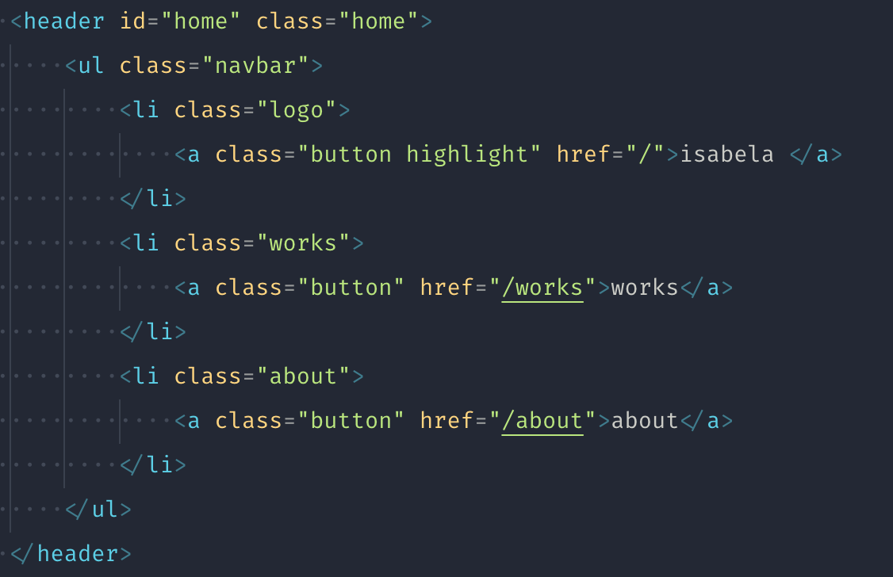
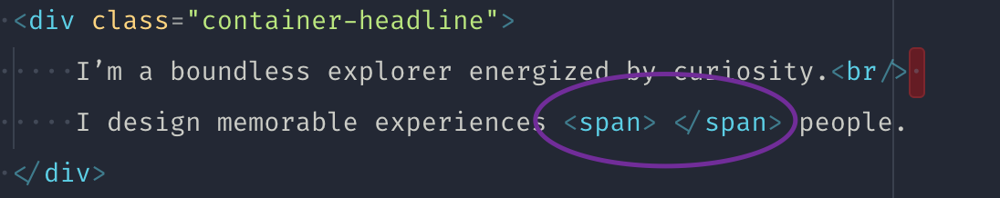
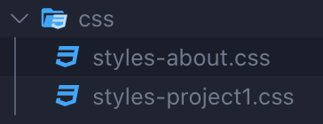

# Review final

Has conseguido un buen resultado, sin embargo, hay algunas cosas a pulir.

En varias páginas tienes un pequeño error que hace que salga un scroll horizontal en móvil. En el caso de la página de Home y About es por el título, que es mucho más grande y rompe la página. Y aprovecharía para darle más tamaño al texto de abajo, queda muy angosto. En el caso del proyecto de Grand Adventure es por culpa de una imagen, la infografía.

El header puedes solucionarlo de manera más simple. Ya sea eliminando elementos no necesarios o maquetándolo como lista en lugar de divs, por lo menos quedaría mejor semánticamente.

Y haría lo mismo en los links del footer. Hay que intentar simplificar al máximo el HTML.

El texto que va cambiando está bien, pero qué pasaría si no funciona Javascript? o lo tengo deshabilitado? El texto quedaría mal formado, yo te diría que añadas un texto inicial en el html y que después se reemplazará con Javascript

Recuerda añadir el atributo `rel="noreferrer noopener"` a todos los links `target="_blank"` que vayan fuera de tu web.

Se te ha quedado un CSS que no utilizas en la carpeta de assets, y cambiaría el nombre de `styles-about.css` ya que confunden un poco.

En cuanto al Javascript, está muy bien, pero necesitas añadir el `eventListener` de click, ya que actualmente está en hover y no se muestra el contenido en móvil. Ten en cuenta que en móvil no hay hover.

Por lo demás lo veo muy bien, está bien organizado y genial que hayas optimizado el peso de las imágenes.
